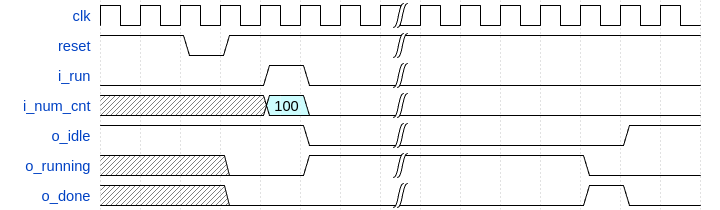

# Matbi FPGA Season 1 Lab16 BRAM Data Mover

## Using AXI4-Stream

### Strategy

|          <b>Diagram</b>           |
| :-------------------------------: |
|  |

---

|           <b>core waveform</b>            |
| :---------------------------------------: |
|  |

> reset : active low
> PS가 0번 레지스터를 이용해 run을 high로 띄우고
> 갯수(100개) 줌
